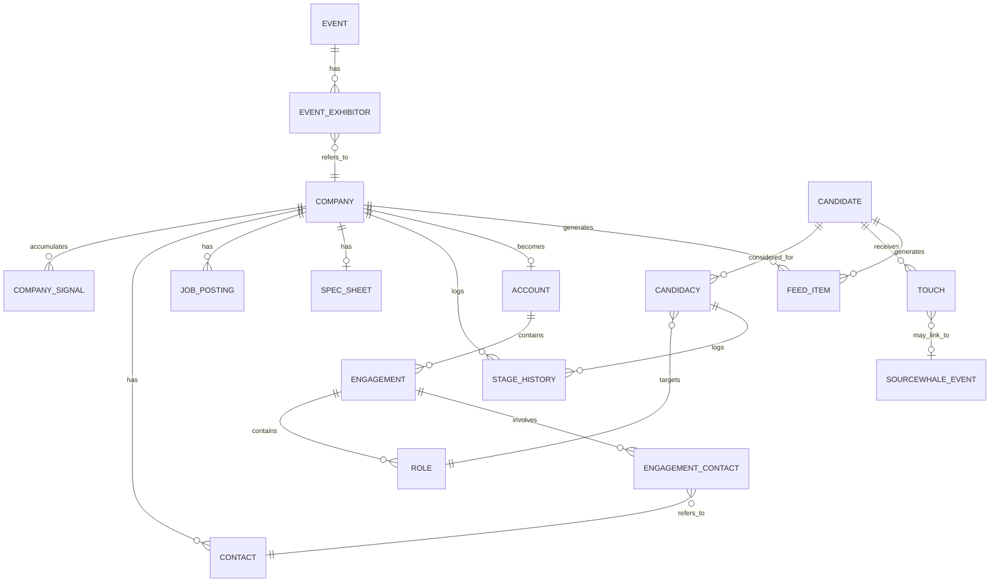
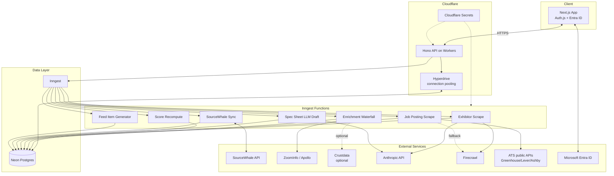
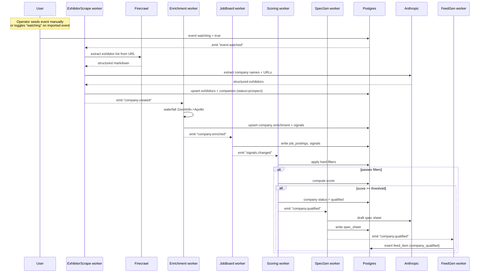
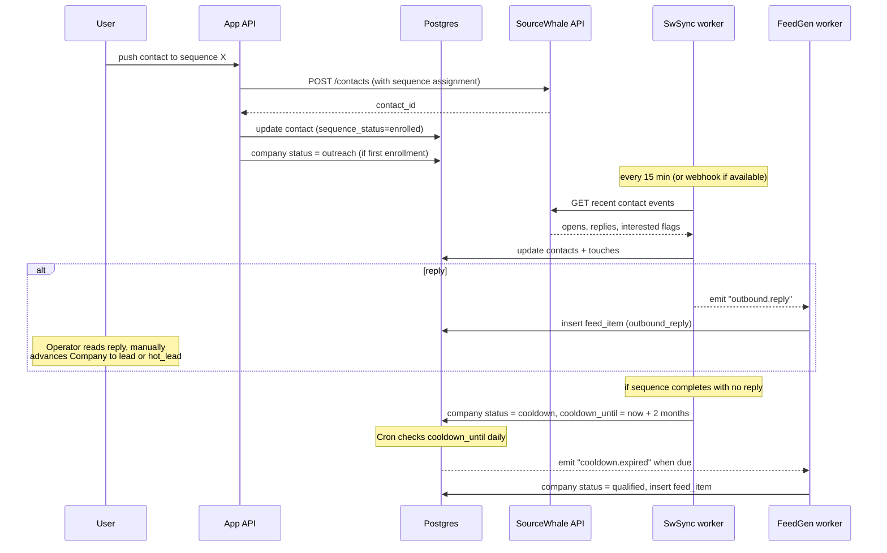
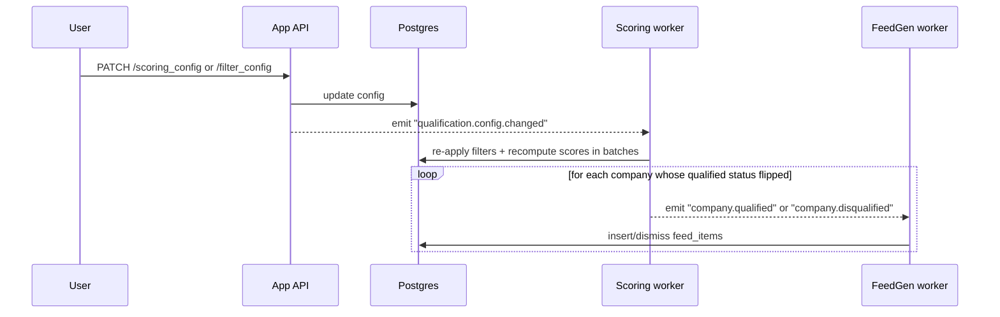
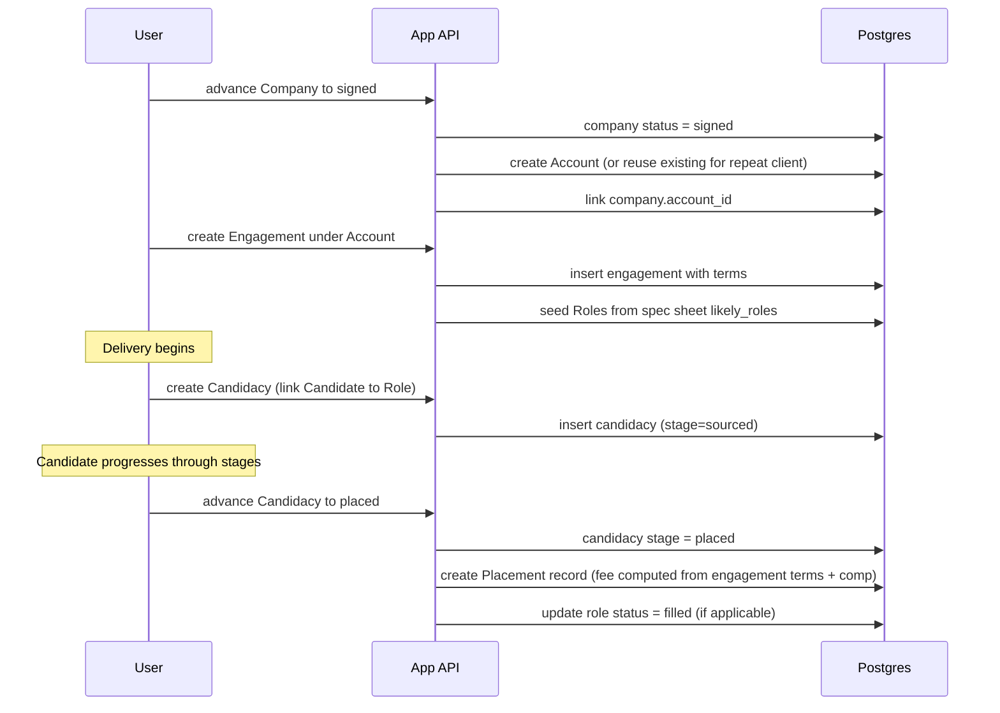

# Solo Recruiter BD + Sourcing Platform — Technical Spec v0.3

**Status:** Draft for review
**Audience:** Hutch (Yak Yak Solutions), engineering & client
**Working name:** TBD (placeholder: **Beachhead**)

### Changelog
- **v0.3** — Domain model overhaul after grilling session. Removed `opportunities` table — Company carries pipeline status directly (`prospect → qualified → outreach → lead → hot_lead → meeting_booked → meeting_held → proposal_sent → signed`). Separated hard filters from soft scoring. Renamed `accounts` table to `companies`. New `accounts` table represents signed client relationships (persists across Engagements). Candidates are now global (not per-Role) with `candidacies` join table. Spec sheets re-parented to Company. Contact outreach state tracked per-contact. Lost reason enum is user-configurable. See CONTEXT.md and docs/adr/ for full rationale.
- **v0.2** — Locked stack decisions: Next.js + Hono + Neon (Postgres), Inngest for orchestration (LangGraph evaluated and rejected), Auth.js with Microsoft Entra ID single-user allowlist, Firecrawl as primary scraper with custom Workers fetch for ATS boards. Removed Durable Objects from v1 (deferred to v2 if live-update UI emerges). Removed Clerk/WorkOS. Multi-tenant deferred — `organization_id` retained as nullable column for future-proofing only.
- **v0.1** — Initial spec (entities, user stories, scoring model).

---

## 1. Overview

A single-operator web app for a niche industrial-services recruiter. Combines two pipelines under one roof:

- **BD pipeline** — discover companies via conference exhibitor lists and other signals, qualify them by firmographics (size, geography, hiring activity), score them against a tunable model, prospect into them via SourceWhale, convert to signed engagements.
- **Delivery pipeline** — once an engagement is signed, manage roles and the candidate funnel through to placement.

The app is the recruiter's morning-coffee surface and the system of record for the *human-judgment* parts of the workflow. SourceWhale remains the system of record for outbound execution. ZoomInfo (or a substitute) is the firmographics/contacts source. LinkedIn Recruiter stays separate (no public API) but is bridged via browser extension or manual round-trip in v1.

### Verticals targeted
SIPA contractors, NDT, TIC (Testing/Inspection/Certification & Compliance), refractory services, industrial services, I&E contractors, hard-craft and soft-craft services.

### Company qualification (v1 default)
**Hard filters (pass/fail):**
- Headcount: 25–300 employees
- Geography: US or Canada

**Scoring signals (ranking among filtered companies):**
- Open sales or operations roles, recent funding, PE ownership, leadership changes, event exhibitor status, multi-site expansion, certifications

---

## 2. Personas

**Primary: The Operator** (the friend). Solo recruiter. Lives in his email, LinkedIn Recruiter, SourceWhale, and ZoomInfo today. Wants one screen that tells him what to work on next without pulling him out of his existing tools.

**Secondary (future): Junior Researcher.** If he ever hires a VA or junior, they need a constrained view (e.g., "research these 20 accounts, fill spec sheets") without admin access to scoring or integrations.

---

## 3. User Stories

Organized by epic. Format: *As [persona], I want [capability] so that [outcome].* Acceptance criteria for the v1-critical stories.

### Epic A: Event Discovery & Watching

**A1.** As Operator, I want the app to automatically discover upcoming industry events relevant to my verticals so I don't have to maintain an event calendar manually.
- AC: Events index populates from configured vertical taxonomies. Each event has name, date(s), location, URL, vertical tags, and a "watching" toggle. Discovery runs weekly.

**A2.** As Operator, I want to mark an event as "watching" so the system scrapes its exhibitor list and pushes those companies into my account pipeline.
- AC: Toggling watch triggers a scrape job within 5 minutes. Scrape failures are surfaced with a retry button. Companies are de-duped against existing accounts.

**A3.** As Operator, I want to see pre-event, during-event, and post-event signal context on each account so I can time outreach to the conference.
- AC: Account record displays source event(s), event date, and a "days to/from event" indicator.

### Epic B: Company Discovery, Enrichment & Scoring

**B1.** As Operator, I want exhibitor companies enriched with firmographics (headcount, geography, industry, revenue band, key contacts) so I can qualify them without manual research.
- AC: Enrichment runs automatically on ingest. Sources tried in waterfall (ZoomInfo → fallback). Each field shows source + confidence + last-updated. Failed enrichment is flagged, not silently dropped.

**B2.** As Operator, I want a tunable scoring model with weighted signals and an adjustable threshold so I can adapt the scoring as I learn what works.
- AC: Settings page has a "scoring" section with each signal as a row (label, weight slider 0–50, enabled toggle). Threshold slider sets the qualification cutoff. Score recomputes across all accounts within 60 seconds of save.

**B3.** As Operator, I want an explainability view on each account showing which signals contributed which points, so I trust the score.
- AC: Account detail page has a "Why this score" panel listing each signal, its current value, weight, points awarded, and source citation.

**B4.** As Operator, I want to see open sales or operations roles publicly posted at each account so I can use them as outreach hooks and timing signals.
- AC: Job board scrape attempts run on a schedule per account. Surfaced roles include title, posted date, source URL. Title-level matching is configurable per vertical.

**B5.** As Operator, I want to manually add or import accounts so I can include companies not surfaced by event scraping.
- AC: "Add account" form + CSV import. Manually-added accounts go through the same enrichment + scoring pipeline.

### Epic C: BD Pipeline

**C1.** As Operator, I want Companies that pass hard filters and scoring threshold to automatically move to `qualified` status so I know which prospects to work.
- AC: Qualification runs after enrichment. Status change is idempotent on re-score. Spec Sheet LLM draft triggers within 2 minutes.

**C2.** As Operator, I want a structured spec sheet on each qualified Company, mostly LLM-pre-filled and edit-in-place, so I can review and refine rather than author from scratch.
- Fields: likely roles (titles + count), pain-point hypotheses, recent signals summary, suggested pitch angle, recommended sequence, recommended primary contact.
- AC: LLM draft generated within 2 minutes of qualification. Each field individually editable. "Regenerate" button per field. Edited fields are marked as human-confirmed. Spec Sheet is refreshed on re-qualification after cooldown; human-confirmed fields preserved.

**C3.** As Operator, I want to see and manage 1–N contacts per Company, with each contact having relevance ranking and outbound state, so I can pursue multiple stakeholders.
- AC: Contacts list with title, seniority, relevance score (LLM-derived from spec sheet), SourceWhale sequence enrollment status, last touch date. Rejection is per-contact — one contact declining does not kill the Company.

**C4.** As Operator, I want a one-click "push contact to SourceWhale sequence X" action so I move from research to outbound without leaving the app.
- AC: Action shows sequence picker (synced from SourceWhale). Push creates contact in SourceWhale and links the IDs back. Failures are surfaced. Company status moves to `outreach` on first enrollment.

**C5.** As Operator, I want Company pipeline status to advance through a defined funnel: `prospect → qualified → outreach → lead → hot_lead → meeting_booked → meeting_held → proposal_sent → signed`.
- AC: `prospect → qualified` is automatic (scoring). `outreach` is automatic (first SourceWhale enrollment). `lead` is set manually when a contact responds. `hot_lead` through `signed` are manual advances. Stage history logged with timestamp and optional note.

**C6.** As Operator, I want to capture a structured "lost reason" when a Company is marked Rejected so I can analyze patterns later.
- Enum (user-configurable, defaults): `no_budget`, `using_competitor`, `no_open_roles`, `ghosted`, `bad_fit`, `wrong_timing`, `internal_hire`, `other_with_note`.
- AC: Marking Rejected requires a reason selection. Free-text note optional except when "other". Rejected Companies can be manually re-activated to `qualified` when circumstances change.

**C7.** As Operator, I want Companies that reach `signed` to convert to Accounts with Engagements without re-entering data.
- AC: "Convert to Account" action on `signed` status. Account is created (or reused if Company was a prior client). Engagement is created under the Account. Spec sheet likely roles seed Role records. Company retains its full pipeline history.

**C8.** As Operator, I want Companies with no outreach response to enter a 2-month cooldown, then become re-eligible for outreach.
- AC: Cooldown clock starts when the SourceWhale sequence completes with no reply. Company status moves to `cooldown`. After 2 months (configurable), status returns to `qualified`. High-value signals during cooldown surface in the feed and allow manual override.

### Epic D: Engagement & Role Management

**D1.** As Operator, I want each Engagement to hold one or more Roles I'm contracted to fill, with structured definition (title, level, location, comp band, must-haves, nice-to-haves).
- AC: Role CRUD. Title-level templates editable per role. Templates seedable from spec sheet.

**D2.** As Operator, I want to see Roles grouped by Engagement and by status (Open, On Hold, Filled, Cancelled) so I know my active workload.

### Epic E: Candidate Pipeline

**E1.** As Operator, I want a candidate pipeline per Role with stages (Sourced → Contacted → Replied → Screened → Submitted → Interview → Offer → Placed | Rejected) so I can track delivery.

**E2.** As Operator, I want SourceWhale outbound state (sent, opened, replied, interested) reflected on candidate cards so I don't context-switch to check.
- AC: SourceWhale sync runs every N minutes (configurable, default 15). Cards show last-known state with timestamp.

**E3.** As Operator, I want to manually advance candidates through the human-judgment stages (Screened, Submitted, Interview, Offer, Placed) regardless of outbound state.

**E4.** As Operator, I want to add candidates to a Role manually, by CSV import, or by linking from a LinkedIn Recruiter project (manual paste of profile URL acceptable in v1).

### Epic F: Morning Activity Feed

**F1.** As Operator, I want a unified reverse-chronological activity feed as the home screen, with type-filter chips, so I can triage the day.
- Item types: `company_qualified`, `company_signal` (role posted, funding, leadership change), `outbound_reply`, `company_stage_change`, `candidacy_update`, `enrichment_failure`, `cooldown_expired`, `guarantee_expiring`, `placement_fee_due`.
- AC: Feed sorts by recency by default. User-adjustable filters and sort. Each item has 1–3 quick actions (Open, Snooze, Dismiss).

**F2.** As Operator, I want to snooze feed items for N days so I can defer without forgetting.
- AC: Snoozed items disappear from feed and reappear at the snooze expiry date.

**F3.** As Operator, I want a "today's priority" header showing top 3 items by a configurable urgency function (recency × score × stage), so even within the feed there's a clear "start here".

### Epic G: Settings & Admin

**G1.** As Operator, I want to manage scoring weights, threshold, and the title-level templates per vertical from one Settings area.

**G2.** As Operator, I want to connect/disconnect integrations (SourceWhale, ZoomInfo, calendar) from Settings.

**G3.** As Operator, I want to see job/sync health (last successful run per integration, error counts) so I know when something's broken.

---

## 4. Data Model

### 4.1 Entity overview

### 4.2 Tables (Postgres-flavored)

#### `events`
| col | type | notes |
|---|---|---|
| id | uuid PK | |
| name | text | |
| start_date | date | |
| end_date | date | |
| location | text | |
| url | text | |
| vertical_tags | text[] | e.g. `{ndt, refractory}` |
| discovered_at | timestamptz | |
| watching | bool | default false |
| last_scrape_at | timestamptz | nullable |
| last_scrape_status | text | `ok`, `failed`, `partial` |

#### `event_exhibitors`
Join table; an exhibitor row may exist before the company is enriched.
| col | type | notes |
|---|---|---|
| id | uuid PK | |
| event_id | uuid FK | |
| raw_name | text | as scraped |
| raw_url | text | nullable |
| company_id | uuid FK | nullable until matched/enriched |

#### `companies`
The canonical representation of an external organization. Carries its own BD pipeline status.
| col | type | notes |
|---|---|---|
| id | uuid PK | |
| name | text | |
| domain | text | unique lookup key |
| hq_country | text | |
| hq_state | text | |
| employee_count | int | nullable |
| employee_band | text | `<25`, `25-100`, `100-300`, `300+` |
| industry | text[] | |
| revenue_band | text | nullable |
| linkedin_url | text | |
| enrichment_sources | jsonb | per-field source/confidence/timestamp |
| current_score | int | denormalized; recomputed on signal/weight change |
| status | text | `prospect`, `qualified`, `outreach`, `cooldown`, `lead`, `hot_lead`, `meeting_booked`, `meeting_held`, `proposal_sent`, `signed`, `rejected` |
| status_changed_at | timestamptz | |
| cooldown_until | timestamptz | nullable; set when entering cooldown |
| lost_reason | text | nullable; required when status = rejected |
| lost_note | text | nullable |
| source | text | `event_scrape`, `zoominfo_search`, `linkedin`, `manual`, `csv`, `referral` |
| account_id | uuid FK | nullable; set when Company becomes an Account |
| owner | text | future multi-user |
| created_at, updated_at | timestamptz | |

#### `company_signals`
Append-only log of scoring inputs.
| col | type | notes |
|---|---|---|
| id | uuid PK | |
| company_id | uuid FK | |
| signal_type | text | `open_sales_role`, `open_ops_role`, `recent_funding`, `leadership_change`, `pe_owned`, `multi_site_expansion`, `certification_added`, `event_exhibitor` |
| value | jsonb | structured payload |
| source | text | `zoominfo`, `apollo`, `job_board:greenhouse`, `event_scrape:<event_id>`, `manual`, etc. |
| observed_at | timestamptz | |
| weight_at_observation | int | snapshot for audit |

#### `filter_config`
Hard pass/fail gates. Companies failing any filter are disqualified.
| col | type | notes |
|---|---|---|
| id | uuid PK | |
| filters | jsonb | `{headcount_min: 25, headcount_max: 300, geography: ["US", "CA"]}` |
| updated_at | timestamptz | |
| updated_by | text | |

#### `scoring_config`
Soft scoring for ranking among filtered companies.
| col | type |
|---|---|
| id | uuid PK |
| weights | jsonb (`{signal_type: weight}`) |
| threshold | int |
| updated_at | timestamptz |
| updated_by | text |

#### `contacts`
People at a Company. Persist across the full lifecycle. Outreach state tracked per-contact.
| col | type | notes |
|---|---|---|
| id | uuid PK | |
| company_id | uuid FK | |
| first_name, last_name | text | |
| title | text | |
| seniority | text | `c_suite`, `vp`, `director`, `manager`, `ic` |
| function | text | `sales`, `ops`, `engineering`, `hr`, `finance`, `owner`, `other` |
| email, phone, linkedin_url | text | |
| sourcewhale_contact_id | text | nullable |
| relevance_score | int | 0–100, LLM-derived from spec sheet |
| sequence_status | text | `not_enrolled`, `enrolled`, `replied`, `interested`, `not_interested`, `bounced` |
| last_touch_at | timestamptz | nullable |
| last_enriched_at | timestamptz | |

#### `job_postings`
Publicly posted positions scraped from job boards. A scoring signal, not a Role.
| col | type | notes |
|---|---|---|
| id | uuid PK | |
| company_id | uuid FK | |
| title | text | |
| function | text | derived |
| location | text | |
| posted_at | date | |
| source_url | text | |
| source_board | text | `greenhouse`, `lever`, `ashby`, `linkedin`, `indeed`, `company_site` |
| status | text | `open`, `closed`, `unknown` |

#### `spec_sheets`
LLM-drafted research brief. One per Company, refreshed on re-qualification.
| col | type | notes |
|---|---|---|
| id | uuid PK | |
| company_id | uuid FK unique | |
| likely_roles | jsonb | `[{title, level, count, confidence}]` |
| pain_points | text[] | |
| signals_summary | text | LLM prose |
| pitch_angle | text | |
| recommended_sequence_id | text | nullable |
| recommended_primary_contact_id | uuid | nullable |
| draft_generated_at | timestamptz | |
| fields_human_confirmed | text[] | which fields were edited/confirmed |

#### `accounts`
A signed client relationship. Persists across multiple Engagements.
| col | type | notes |
|---|---|---|
| id | uuid PK | |
| company_id | uuid FK | |
| status | text | `active`, `inactive` — derived from whether any Roles are open |
| signed_at | date | first signing date |
| created_at | timestamptz | |

#### `engagements`
A discrete scope of work under an Account.
| col | type | notes |
|---|---|---|
| id | uuid PK | |
| account_id | uuid FK | |
| name | text | e.g. "ACME Q3 sales hire" |
| status | text | `active`, `paused`, `completed`, `cancelled` |
| signed_at | date | |
| fee_type | text | `contingency`, `retained`, `flat_fee` |
| fee_percent | numeric | nullable; e.g. 20.0 for contingency |
| fee_amount | int | nullable; flat fee in cents |
| exclusivity | bool | |
| guarantee_days | int | nullable; replacement guarantee period |
| payment_terms | text | nullable; e.g. `net_30`, `net_60` |
| notes | text | nullable; free-form engagement notes |

#### `engagement_contacts`
Links Contacts to their role in a specific Engagement (e.g., hiring manager).
| col | type | notes |
|---|---|---|
| engagement_id | uuid FK | |
| contact_id | uuid FK | |
| role_in_engagement | text | `hiring_manager`, `hr_lead`, `decision_maker`, `coordinator`, `other` |
| PK | (engagement_id, contact_id) | |

#### `roles`
A position the operator is contracted to fill under an Engagement.
| col | type | notes |
|---|---|---|
| id | uuid PK | |
| engagement_id | uuid FK | |
| title | text | |
| level | text | configurable per vertical |
| function | text | |
| location | text | |
| comp_low, comp_high | int | nullable |
| must_haves | text[] | |
| nice_to_haves | text[] | |
| status | text | `open`, `on_hold`, `filled`, `cancelled` |

#### `candidates`
A person in the operator's talent pool. Global — not tied to a specific Role.
| col | type | notes |
|---|---|---|
| id | uuid PK | |
| first_name, last_name | text | |
| current_title | text | |
| current_company | text | |
| linkedin_url | text | |
| email, phone | text | |
| source | text | `linkedin_recruiter`, `manual`, `csv`, `referral` |
| sourcewhale_contact_id | text | nullable |
| created_at | timestamptz | |

#### `candidacies`
The association between a Candidate and a Role. Carries per-role stage progression.
| col | type | notes |
|---|---|---|
| id | uuid PK | |
| candidate_id | uuid FK | |
| role_id | uuid FK | |
| stage | text | `sourced`, `contacted`, `replied`, `screened`, `submitted`, `interview`, `offer`, `placed`, `rejected` |
| stage_changed_at | timestamptz | |
| created_at | timestamptz | |
| unique | (candidate_id, role_id) | no duplicate candidacies |

#### `placements`
Created when a Candidacy reaches `placed`. The financial record of a successful placement.
| col | type | notes |
|---|---|---|
| id | uuid PK | |
| candidacy_id | uuid FK unique | |
| role_id | uuid FK | denormalized for easier queries |
| engagement_id | uuid FK | denormalized |
| account_id | uuid FK | denormalized |
| placed_at | date | |
| start_date | date | nullable; candidate's start date |
| candidate_comp | int | nullable; actual annual comp in cents |
| fee_earned | int | in cents; computed from engagement terms + comp |
| fee_status | text | `pending`, `invoiced`, `paid`, `refunded` |
| guarantee_expiry | date | nullable; computed from engagement guarantee_days |
| notes | text | nullable |

#### `stage_history`
Polymorphic: works for companies, candidacies, roles.
| col | type |
|---|---|
| id | uuid PK |
| entity_type | text (`company`, `candidacy`, `role`) |
| entity_id | uuid |
| from_stage | text |
| to_stage | text |
| changed_at | timestamptz |
| changed_by | text |
| note | text nullable |

#### `touches`
Communication events on candidates.
| col | type | notes |
|---|---|---|
| id | uuid PK | |
| candidate_id | uuid FK | |
| channel | text | `email`, `linkedin`, `phone`, `sms`, `whatsapp` |
| direction | text | `outbound`, `inbound` |
| occurred_at | timestamptz | |
| sourcewhale_event_id | text | nullable |
| summary | text | |

#### `feed_items`
The morning activity stream. Materialized rather than computed at read time.
| col | type | notes |
|---|---|---|
| id | uuid PK | |
| item_type | text | enum, see F1 |
| entity_type | text | `company`, `candidate`, `event` |
| entity_id | uuid | |
| occurred_at | timestamptz | sort key |
| urgency_score | int | for "today's priority" header |
| snoozed_until | timestamptz | nullable |
| dismissed_at | timestamptz | nullable |
| payload | jsonb | display data (title, body, action affordances) |

#### `lost_reasons`
User-configurable enum for rejection reasons.
| col | type | notes |
|---|---|---|
| id | uuid PK | |
| label | text | display name |
| slug | text | unique, e.g. `no_budget` |
| active | bool | soft delete |
| sort_order | int | |

#### `integration_state`
| col | type |
|---|---|
| integration | text PK (`sourcewhale`, `zoominfo`, `calendar`) |
| connected | bool |
| last_sync_at | timestamptz |
| last_sync_status | text |
| credentials_ref | text (KMS/secret-manager handle) |

---

## 5. System Architecture

### 5.1 High-level

> **Note on event discovery:** The dedicated Event Discovery worker has been removed from v1 in favor of a seeded vertical event list maintained manually by the operator. See section 10 phasing — auto-discovery is a v2 feature.

### 5.2 Component choices (with rationale)

#### Frontend
**Next.js (React) on Cloudflare Pages.** Web-first, desktop-first — this is a morning-coffee surface, not a mobile app. Mobile read-only triage view is a v2 consideration.

#### API layer
**Hono on Cloudflare Workers.** Light, fast, edge-deployed, plays well with the rest of the Cloudflare stack. Fronted by Auth.js for session management.

#### Database
**Neon (Postgres).** D1 was considered for full Cloudflare alignment but rejected — the relational complexity (joins across companies, contacts, signals, candidacies, stage history) lands outside D1's sweet spot. Neon supports branching for dev/preview, scales without fuss, and connects from Workers via **Cloudflare Hyperdrive** for connection pooling and edge caching. Schema migrations via Drizzle (consistent with existing stack).

#### Orchestration: Inngest (LangGraph rejected for v1)
**Inngest** for all background work. The orchestration needs are classic durable-workflow patterns: cron triggers (weekly event-list refresh), fan-out (one event -> N exhibitor enrichments), retries on flaky vendor APIs, polled syncs every 15 minutes, and short async LLM calls.

LangGraph was evaluated and rejected for v1. LangGraph is an *agent orchestration* library — multi-step LLM reasoning, conditional branches based on model output, tool-use loops, human-in-the-loop checkpoints. The LLM calls in this system are single-shot prompts ("given firmographics + signals, draft a spec sheet"), not multi-step agentic reasoning. Using LangGraph here would burn complexity budget without delivering its actual value.

These tools are **complementary**, not competitive. If spec drafting later evolves into something genuinely agentic ("research the company -> check SEC filings -> look up parent org -> synthesize"), that agent loop runs *inside* an Inngest function. Inngest is the outer durable layer; an agent framework would be inner orchestration *if and when needed*.

#### Per-account state: Durable Objects rejected for v1
DOs were considered and rejected. They're the right tool when you need WebSocket fan-out to a live multi-user UI, single-threaded serialization on a per-entity basis (chat-room pattern), or stateful per-entity compute hot at the edge. None of those apply here:
- Single user — no multi-user collaboration to broadcast to.
- Live UI updates can be SSE or simple polling.
- Rate-limiting external APIs is handled by Inngest concurrency primitives.
- Per-account state lives just fine in Postgres.

Postgres + Inngest + Hono on Workers is the right v1 stack. Revisit DOs if a future requirement emerges for live "syncing now..." indicators across all account cards or a multi-user collaborative version.

#### LLM
**Anthropic Claude** via API. Used for spec sheet drafting, signal summary prose, lost-reason classification, and inbound-reply tagging if SourceWhale's NLP proves unreliable.

#### Scraping & data extraction (layered approach)

Apify was the original placeholder; the actual v1 stack is layered, with Apify demoted to an optional fallback:

**Tier 1 — Custom fetch in Workers (free, fast).**
Greenhouse, Lever, and Ashby all expose public JSON endpoints (e.g., `boards-api.greenhouse.io/v1/boards/{company}/jobs`). For these and similar predictable structured sources (company sitemaps, RSS feeds), a plain HTTP fetch from a Worker is the right tool. No third-party dependency, no rate-limit anxiety.

**Tier 2 — Firecrawl (LLM-friendly extraction).**
Primary tool for conference exhibitor pages and ad-hoc company sites. Firecrawl returns clean markdown or structured JSON from any URL, handles JS rendering and basic anti-bot, and pairs naturally with a Claude extraction call. Maintaining N custom scrapers per conference organizer is exactly what Firecrawl exists to avoid. Sane pricing for solo-operator volume.

**Tier 3 — Crustdata or Coresignal (paid, evaluate before building).**
Sells job-posting data and firmographics as APIs, skipping scraping entirely. If your friend can stomach a few hundred dollars a month, Crustdata could *replace* the JobScrape worker outright — buying coverage rather than maintaining scrapers. Worth pricing before committing to scraper infrastructure.

**Tier 4 — Bright Data / ScrapingBee or Apify (anti-bot fallback).**
Reserved for sites with aggressive anti-bot (Indeed at scale, LinkedIn) that need rotating residential proxies or full headless browser sessions. Probably not v1; design assumes we don't need this.

#### Auth
**Auth.js (NextAuth) with Microsoft Entra ID provider.** Single email allowlist in the `signIn` callback, session cookie. Configure an Azure AD app registration in his tenant, set the redirect URL to the Next.js app, allowlist his email, done — roughly half a day of setup including the Azure side.

Clerk and WorkOS were considered and rejected — priced for multi-user products this app doesn't need.

#### Multi-tenancy
**Deferred.** `organization_id` retained as a *nullable column* on top-level entities (companies, accounts, engagements) to make a future migration mechanical, but **not enforced** in queries or middleware. If/when the app is productized, add the filter at that point. Until then, no overhead.

#### Secrets
**Cloudflare Secrets** for all API keys and integration credentials. Accessed via Workers bindings; never in repo, never in DB.

### 5.3 Integration adapters

Each external service is wrapped behind a thin internal interface in the codebase, so swapping providers is a shim change rather than an app rewrite. Optionally exposable as MCP servers later for reuse across other Yak Yak / Hackistan projects.

- **SourceWhale adapter** — exposes `list_sequences`, `add_contact_to_sequence`, `get_contact_status`, `list_recent_events`. Wraps SourceWhale's REST API with the API key.
- **Firmographics adapter** — exposes `enrich_company(domain)`, `enrich_contact(linkedin_url)`. Default impl: ZoomInfo. Fallback: Apollo. Both behind the same interface.
- **Job board adapter** — exposes `find_open_roles(company_domain, function_filter)`. Fans out to Greenhouse/Lever/Ashby public APIs first, falls back to Firecrawl for company career pages where no ATS is detected. If Crustdata gets adopted, the entire adapter implementation changes; the interface doesn't.
- **Web extraction adapter** — exposes `extract_structured(url, schema)`. Wraps Firecrawl + Claude.

The principle: **the app talks to interfaces, not vendors.**

---

## 6. Data Flow Diagrams

### 6.1 Event -> qualified Company -> spec sheet

### 6.2 Outbound: Company -> SourceWhale and back

### 6.3 Score recomputation on config change

### 6.4 Signing -> Account -> Engagement -> Placement

---

## 7. Functional Requirements

| # | Requirement |
|---|---|
| FR-1 | Operator can seed and manage a curated event list (manual entry or CSV import) tagged by vertical. Auto-discovery deferred to v2. |
| FR-2 | User can toggle "watching" on any event, which triggers exhibitor scrape within 5 minutes. |
| FR-3 | Every Company ingest triggers enrichment via the configured firmographics waterfall. |
| FR-4 | Enrichment failure is surfaced to the user (feed item type `enrichment_failure`), never silently dropped. |
| FR-5 | Hard filters (pass/fail) and scoring weights/threshold are user-editable; full recompute completes within 60 seconds for <=10k companies. |
| FR-6 | Each Company exposes a "Why this score" panel with per-signal contribution and source citation (scoring signals only, not filters). |
| FR-7 | Companies passing hard filters and scoring threshold auto-advance to `qualified` status (idempotent on re-score). |
| FR-8 | Each qualified Company has a Spec Sheet, LLM-drafted within 2 minutes of qualification. Refreshed on re-qualification; human-confirmed fields preserved. |
| FR-9 | Spec sheet fields are individually editable and individually regenerable. Edited fields are flagged human-confirmed. |
| FR-10 | Each Company supports 1-N contacts with relevance scores and per-contact SourceWhale sequence enrollment status. Contact rejection does not reject the Company. |
| FR-11 | "Push to SourceWhale sequence" is a one-click action, with sequence picker populated live from SourceWhale. |
| FR-12 | Company pipeline status follows the defined funnel (`prospect → qualified → outreach → lead → hot_lead → meeting_booked → meeting_held → proposal_sent → signed`); stage changes are logged with timestamp and optional note. |
| FR-13 | Marking a Company as Rejected requires selecting a reason from the user-configurable lost reason enum. Rejected Companies can be manually re-activated. |
| FR-14 | Companies reaching `signed` convert to Accounts with Engagements; spec sheet likely roles seed Role records. Existing Accounts are reused for repeat clients. |
| FR-15 | Each Role has a candidate pipeline via Candidacies with the defined stages; cards reflect SourceWhale outbound state. Candidates are global and can be linked to multiple Roles. |
| FR-16 | SourceWhale sync runs on configurable interval (default 15 min) and on user-triggered "Refresh now". |
| FR-17 | Home screen has both activity feed and pipeline board. Feed is default landing view with type-filter chips; pipeline board shows Companies by status. |
| FR-18 | Feed items support snooze (N days) and dismiss; snoozed items reappear at expiry. |
| FR-19 | Settings exposes: qualification config (hard filters + scoring), pipeline config (lost reasons, cooldown duration), integration management, title-level templates, and sync health. |
| FR-20 | All entities support manual create/edit; CSV import for Companies and Candidates. |
| FR-21 | Companies with no outreach response enter 2-month cooldown (configurable). High-value signals during cooldown surface in feed and allow manual override. |

---

## 8. Non-Functional Requirements

### Performance
| # | Requirement |
|---|---|
| NFR-1 | Home/feed load < 800ms p50, < 2s p95 from cache. |
| NFR-2 | Company detail page < 1.2s p50 with full spec sheet and contacts. |
| NFR-3 | Score recompute across 10k companies < 60s. |
| NFR-4 | LLM spec draft latency < 2 min p95 (async; user gets a feed item when ready). |

### Reliability
| # | Requirement |
|---|---|
| NFR-5 | Background jobs idempotent (safe to retry). Inngest handles retry policy. |
| NFR-6 | External API failures degrade gracefully — never block the UI; surface via feed/health panel. |
| NFR-7 | Database backups daily, point-in-time recovery 7 days (Neon default fine). |

### Data quality
| # | Requirement |
|---|---|
| NFR-8 | Every enriched field carries source + confidence + timestamp; UI surfaces stale data warnings (>90 days). |
| NFR-9 | De-dup on `companies.domain` and `contacts.email` at write time. |
| NFR-10 | `company_signals` is append-only (audit trail). |

### Security & privacy
| # | Requirement |
|---|---|
| NFR-11 | All secrets in Cloudflare Secrets / equivalent; never in DB or repo. |
| NFR-12 | Auth required on every API endpoint. `organization_id` retained as nullable column for future multi-tenancy; row-level filtering deferred until productized. |
| NFR-13 | PII (contact emails, phones, candidate data) encrypted at rest by DB provider; in transit via TLS. |
| NFR-14 | GDPR/CCPA delete request workflow even if currently single-user (future-proof). |
| NFR-15 | Audit log of integration credential changes. |

### Compliance / ToS
| # | Requirement |
|---|---|
| NFR-16 | Scraping respects `robots.txt`; rate-limit per-domain to avoid hostile load. |
| NFR-17 | LinkedIn data only via official channels or operator-driven session (browser extension), never headless scraping at scale. |
| NFR-18 | Conference exhibitor scraping limited to publicly-posted lists; gated/paid attendee lists out of scope. |

### Operability
| # | Requirement |
|---|---|
| NFR-19 | Inngest dashboard accessible to operator; failed runs visible without engineer involvement. |
| NFR-20 | Single-binary deploy: `pnpm deploy` ships frontend + workers + migrations. |
| NFR-21 | Local dev parity: Inngest dev server + Postgres in Docker + LLM API key. |

### Cost
| # | Requirement |
|---|---|
| NFR-22 | Cap monthly external API spend (ZoomInfo, LLM) with per-integration budgets and circuit breaker. |
| NFR-23 | Score recompute is incremental where possible; full recompute only on weight change. |

---

## 9. Open Questions & Risks

### Resolved in v0.2
- ~~Stack choice (DB, orchestration, auth, scrapers)~~ — **resolved**: Neon, Inngest, Auth.js + Entra, Firecrawl-led layered approach. See section 5.2.
- ~~Multi-tenancy from day one or not~~ — **resolved**: deferred. Nullable `organization_id` column for future-proofing only.
- ~~Durable Objects for per-account state~~ — **resolved**: not needed for v1.

### Still open
1. **ZoomInfo licensing.** Their API tier that supports company + contact enrichment at meaningful volume starts in five figures annually. Confirm what the friend currently pays for and whether his seat allows API access. If not, design v1 around Apollo + Crustdata/Coresignal; treat ZoomInfo as a pluggable upgrade behind the firmographics adapter.
2. **SourceWhale webhook availability.** API key + bidirectional sync confirmed. Push webhooks not publicly documented — needs a direct ask to their support. Polling at 15 min works fine in the meantime; webhooks are a post-v1 optimization.
3. **LinkedIn Recruiter integration.** No public API. v1 = manual URL paste. v2 = browser extension running in operator's session. Treating LinkedIn as out-of-app entirely is also viable if his LinkedIn workflow is already efficient.
4. **Job board coverage in industrial verticals.** Many of these companies post on their own sites or local job boards, not Greenhouse/Lever/Ashby. Coverage will be patchy with the Tier-1 (free public APIs) approach. Action: measure hit rate on a 50-account sample before promising "open role detection" as a headline scoring signal. If <40% hit rate, evaluate Crustdata as a paid replacement.
5. **Microsoft tenant configuration.** Confirm whether the friend's Outlook is personal (`@outlook.com` / `@hotmail.com`) or part of an organizational Microsoft 365 tenant. Affects Azure AD app registration approach — personal accounts use the Microsoft consumer endpoint; tenant accounts use the org's directory.
6. **Naming.** TBD. Once settled, every reference in this doc updates.

---

## 10. Phasing

### v0 (2 weeks) — Spike
- Fresh stack: Next.js + Hono + Neon + Drizzle. Existing Vite/React app replaced.
- Core Company pipeline: manual company entry, hard-coded filters/scoring, pipeline board (Kanban), company detail page with status transitions.
- No integrations (no SourceWhale, no ZoomInfo, no LLM). No spec sheet generation. No events/scraping.
- Auth: simple hardcoded check (real Entra ID deferred to v1).
- Goal: prove the data model and primary screen flow against real companies in Postgres.

### v1 (10-12 weeks) — Full pipeline MVP
- **BD pipeline:** Epics A (manual event seeding + Firecrawl-driven exhibitor extraction), B (full filters + scoring + explainability), C (full Company pipeline + LLM spec sheets + cooldown mechanics).
- **Delivery pipeline:** Epics D, E. Account creation on signing, Engagement -> Role -> Candidacy -> Placement flow. Manual candidate entry. Revenue tracking.
- **Home screen:** Epic F. Activity feed + pipeline board + snooze.
- SourceWhale push + polled sync (15 min).
- Firmographics adapter with one primary provider + one fallback.
- Job board adapter covering Greenhouse, Lever, Ashby public APIs + Firecrawl fallback for company career pages.
- Auth.js + Entra ID, single-email allowlist.
- `organization_id` nullable columns in place; not enforced.

### v2
- Auto event discovery (LLM-driven from vertical sources, if Tier-1 seeded approach proves insufficient).
- LinkedIn browser extension.
- Calendar integration for meeting auto-detection.
- SourceWhale webhooks (replace polling).
- Crustdata adoption (if job-board hit rate is poor).
- "Junior researcher" constrained role.
- Mobile read-only triage view.

---

## Appendix A: Default qualification config (starting point)

### Hard filters (pass/fail)
| Filter | Default | Notes |
|---|---|---|
| `headcount_min` | 25 | Company disqualified if below |
| `headcount_max` | 300 | Company disqualified if above |
| `geography` | US, CA | Company disqualified if outside |

### Scoring weights (ranking among filtered companies)
| Signal | Weight | Notes |
|---|---|---|
| `open_sales_role` | 25 | Per role, capped at 1 occurrence |
| `open_ops_role` | 20 | Per role, capped at 1 occurrence |
| `event_exhibitor` recent | 15 | Decays over 60 days |
| `recent_funding` (12 mo) | 15 | |
| `leadership_change` (6 mo) | 15 | Sales/Ops/CEO |
| `pe_owned` | 10 | |
| `multi_site_expansion` | 10 | |
| `certification_added` | 10 | NDT, ISO, etc. |
| **Threshold** | **50** | Tunable (lowered from 70 since headcount/geography are now filters, not scored) |

---

## Appendix B: Stage enums

**Company pipeline status:** `prospect`, `qualified`, `outreach`, `cooldown`, `lead`, `hot_lead`, `meeting_booked`, `meeting_held`, `proposal_sent`, `signed`, `rejected`

**Lost reasons (user-configurable, defaults):** `no_budget`, `using_competitor`, `no_open_roles`, `ghosted`, `bad_fit`, `wrong_timing`, `internal_hire`, `other_with_note`

**Account status:** `active` (has open Roles), `inactive` (no open Roles)

**Engagement status:** `active`, `paused`, `completed`, `cancelled`

**Role status:** `open`, `on_hold`, `filled`, `cancelled`

**Candidacy stages:** `sourced`, `contacted`, `replied`, `screened`, `submitted`, `interview`, `offer`, `placed`, `rejected`
